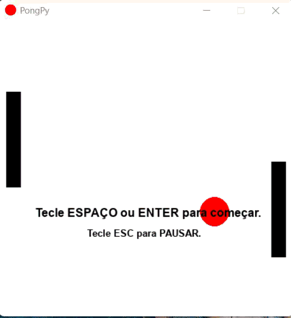

# 🎮 PongPy



Um jogo de Pong clássico desenvolvido em Python com a biblioteca **Pygame**. O projeto apresenta um sistema de Inteligência Artificial para as barras e um "Modo de Demonstração" automático.

## 🚀 Funcionalidades
*   **Modo IA vs IA:** O jogo inicia automaticamente em modo de demonstração, onde duas instâncias do computador se enfrentam.
*   **Modo Jogador:** Pressione `ENTER` ou `ESPAÇO` para assumir o controle e começar a pontuar contra a máquina.
*   **Física Blindada:** Sistema de colisão otimizado que evita que a bola fique presa ou atravesse as barras.
*   **Executável Independente:** Versão compilada que roda sem a necessidade de instalar Python.

## 🕹️ Controles
*   **W / S** ou **Setas (Cima/Baixo):** Movimentam a barra do jogador (lado esquerdo).
*   **ENTER / ESPAÇO:** Inicia o modo de jogo (Jogador vs IA) e realiza o saque.
*   **ESC:** PAUSA e retorna ao modo de demonstração (IA vs IA).

## 🛠️ Como rodar o código
1.  Certifique-se de ter o **Python 3.x** instalado.
2.  Instale a biblioteca Pygame:
    ```bash
    pip install pygame
    ```
3.  Clone o repositório e execute o arquivo principal:
    ```bash
    python main.py
    ```

## 📦 Download da Versão Executável (.exe)
Se você deseja apenas jogar sem configurar o ambiente Python, acesse a aba [Releases](https://github.com/Heloisa-n/pongPy/releases/tag/v1.0) à direita e baixe o arquivo `PongPy.exe`.

> [!CAUTION]
> **⚠️AVISO IMPORTANTE:** O Windows pode acusar vírus por ser um executável não assinado. O código é 100% seguro.

---
Desenvolvido por [Heloisa-n] como projeto de estudo em Python e Pygame.
